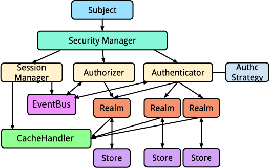

# Architectural Overview

The following diagram depicts Yosai's architecture. Note that only **one**
Realm is provided with `yosai.core` but others are shown to illustrate support for multiple realms (and their respective AccountStore).

## Subject

A `Subject` represents state and security operations for a *single*
application user.  These operations include authentication (login/logout),
authorization (access control), and session access. A subject is Yosai's
primary mechanism for single-user security functionality.

## Security Manager

A `SecurityManager` executes ALL security operations for ALL Subjects (aka users) across a single application.

The interface itself primarily exists as a convenience - it extends the
Authenticator, Authorizer, and SessionManager interfaces, thereby
consolidating these behaviors into a single point of reference.  For most
Yosai usages, this simplifies configuration and tends to be a more
convenient approach than referencing Authenticator, Authorizer, and
SessionManager instances individually.  Instead, one only needs to interact
with a single SecurityManager instance.

In addition to the above three interfaces, this interface provides a number
of methods supporting the behavior of Subject(s). A Subject executes
authentication, authorization, and session operations for a *single* user,
and as such can only be managed by A SecurityManager that is aware of all
three functions.  The three parent interfaces on the other hand do not
'know' about Subject(s) so as to ensure a clean separation of concerns.

## Authenticator
An `Authenticator` performs authentication for any given Subject (aka 'application user').  It uses an authentication strategy to coordinate authentication among one or more realms configured for authentication.

## Authorizer
An `Authorizer` performs authorization (access control) operations for any given Subject (aka 'application user').  It coordinates authorization requests among one or more realms configured for authorization.

## Realm

A `Realm` access application-specific security entities such as accounts,
roles, and permissions to perform authentication and authorization operations.

`Realms` usually have a 1-to-1 relationship with an `AccountStore`,
such as a NoSQL or relational database, file system, or other similar resource.
However, since most Realm implementations are nearly identical, except for
the account query logic, a default realm implementation, `AccountStoreRealm`,
is provided, allowing you to configure it with the data API-specific
`AccountStore` instance.

Because most account stores usually contain Subject information such as
usernames and passwords, a Realm can act as a pluggable authentication module in a [PAM configuration](http://en.wikipedia.org/wiki/Pluggable_Authentication_Modules)
.  This allows a Realm to perform *both* authentication and authorization duties for a single account store, catering to most application needs.  If for some reason you don't want your Realm implementation to participate in authentication, override the `supports(authc_token)` method to always return False.

Because every application is different, security data such as users and roles can be represented in any number of ways.  Yosai tries to maintain a non-intrusive development philosophy whenever possible -- it does not require you to implement or extend any *User*, *Group* or *Role* interfaces or classes.

Instead, Yosai allows applications to implement this interface to access environment-specific account stores and data model objects.  The implementation can then be plugged in to the application's Yosai configuration. This modular technique abstracts away any environment/modeling details and allows Yosai to be deployed in practically any application environment.

Most users will not implement this `Realm` interface directly, but will
instead use an `AccountStoreRealm` instance configured with an underlying
`AccountStore`. This setup implies that there is an `AccountStoreRealm`
instance per `AccountStore` that the application needs to access.

Yosai introduces two Realm interfaces in order to separate authentication
and authorization responsibilities.

## Store

A `Store` is a data repository.  Yosai uses an `AccountStore`, specifically.  An `AccountStore` contains `Account` information, such as credentials, roles, and permissions.

## CacheHandler

A `CacheHandler` provides an abstraction on top of an underlying caching mechanism, such as `yosai_dpcache`, managing key generation and cache region interactions.

## EventBus

An `Eventbus` can publish events to event subscribers as well as provide a
mechanism for registering and unregistering event subscribers.

An event bus enables a publish/subscribe paradigm within Yosai -- components can publish or consume events they find relevant without needing to be tightly coupled to other components.  
