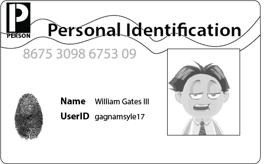

# Authentication



An application bases much of its security on knowing who a user of the system is. Authentication is the process of verifying identity, proving that a subject **is** who *it* claims to be.


# Powerful Authentication using a Simple API

Most of your interactions with Yosai are based on the currently executing user,
called a **Subject**.  You can easily obtain a handle on your subject instance
from anywhere in your code through the SecurityUtils API.

When a developer wishes to authenticate a user using password-based methods,
the first step requires instantiation of an ``AuthenticationToken`` object
recognizable by Yosai.  The `UsernamePasswordToken` is one such kind of token that
 is already implemented in Yosai as part of default support for password-based
authentication. `UsernamePasswordToken` is a consolidation of a user account's
identifying attributes (username) and credentials (password).


## Logging-In and Logging-Out

## Logging-In

When you *log-in*, you are attempting to make a secured system recognize your
presence.  The system recognizes who you are by verifying your identity.  Once your
identity is verified, the system considers you present (logged in) by creating a new,
verified session for you.  

There are two key processes involved with logging-in:
- Session Management
- Authentication

### Session Management

Logging-in consists of authentication followed by instantiation of a new session,
removing a guest session that was created for you earlier.

As you first interact with a system secured with Yosai, Yosai recognizes you as
a *guest*.  A guest is granted an anonymous session (a new one is created) during
the guest's first interaction with the system.  Once authenticated, you are
granted elevated access to the system: your status in the system changes
from when you were anonymous.  The elevation of status involves deleting the anonymous
session and creating a new, *verified* session for you. Once authenticated, you
are considered present through the existence of this *verified* session.

### Authentication, with Example

*Authentication* is the process of verifying identity.  

In the following example, we log-in a Subject by performing password-based
authentication.  This process would raise an AuthenticationException
if it were to fail.  Yosai features a rich exception hierarchy that offers detailed
explanations as to why a login failed. This exception hierarchy helps developers
diagnose bugs or customer service issues related to authentication.

```Python
from yosai.core import SecurityUtils, UsernamePasswordToken

current_user = SecurityUtils.get_subject()

authc_token = UsernamePasswordToken(username='thedude',
                                    credentials='letsgobowling')
authc_token.remember_me = True

try:
    current_user.login(authc_token)
except UnknownAccountException:
    # insert here
except IncorrectCredentialsException:
    # insert here
except LockedAccountException:
    # insert here
except ExcessiveAttemptsException:
    # insert here
except AuthenticationException:
    # insert here
```

As you can see, authentication entails a single method call: ``current_user.login(authc_token)``. The Subject API requires a single method call to authenticate, regardless of the underlying authentication strategy chosen.

Notice that `remember_me` is activated in the authentication token.  Yosai features
native 'remember me' support.  'Remember Me' is a popular feature where users are
remembered when they return to an application.  Remembering your users offers a
more convenient user experience for them, although it does come at a cost in
security.

### Cryptographic Hashing of Passwords

For password-based authentication, Yosai uses the Passlib library for
cryptographic hashing and password verification.

The default hashing scheme chosen for Yosai is *bcrypt_sha256*. As per Passlib
documentation [1], the *bcrypt_sha256* algorithm works as follows:

- First, the password is encoded to UTF-8 if not already encoded.
- Then, the UTF-8 encoded password is run through SHA2-256, generating a 32-byte digest
- The 32-byte digest is encoded using base64, resulting in a 44-byte result
  (including the trailing padding '='):
      For the example "password", the output from this stage would be:
        "XohImNooBHFR0OVvjcYpJ3NgPQ1qq73WKhHvch0VQtg=".

- Finally, the base64 string is passed on to the underlying bcrypt algorithm
  as the new password to be hashed.

For more information about Passlib's bcrypt_sha256, you may [access its documentation here](https://pythonhosted.org/passlib/lib/passlib.hash.bcrypt_sha256.html#algorithm)


## Logging Out

When you *log-out*, the system no longer recognizes your presence nor will it
honor any prior recognition of your identity (you would have to re-authenticate
yourself if you re-engaged the system). When you log-out a user, you are
releasing the identifying state of the user by the application.  A Subject is
logged out when the Subject is done interacting with the application by calling:  ``current_user.logout()``, relinquishing all identifying information and
invalidating the user's session.  If you are logging out in a web app and use
the yosai.web library, the RememberMe cookie will also be deleted.

After a Subject logs-out, the Subject instance is considered anonymous again
and, except for web applications, can be re-used for login again if desired.

!!! note ""
    Because remembered identity in web applications is often persisted with cookies, and cookies can only be deleted before a Response body is committed, it is highly recommended to redirect the end-user to a new view or page immediately after calling current_user.logout(). Doing so guarantees that any security-related cookies are deleted as expected. This is a limitation of how HTTP cookies function and not a limitation of Yosai.


### Automatic Log Out

Automatic log out happens at session expiration.  Yosai expires sessions in two
ways: idle timeout and absolute time to live timeout.  Please consult the
Session Management documentation to learn more about timeouts.


### Manual Log Out

When you manually log-out, you are explicitly telling the system that your work
is done and you do no wish to continue your current session with the system.  
Manual log-out is initiated by a user engaging a log-out operation through a user
interface, such as click a "log-out" or "sign out" button, which would ultimately
call the `logout` method in the Subject API:

```Python
from yosai.core import SecurityUtils, UsernamePasswordToken

current_user = SecurityUtils.get_subject()

current_user.logout()
```

## Factors of Authentication

Authentication methodologies involve three factors:

- something the user **knows**
- something the user **has**
- something the user **is**

Authentication methods that depend on more than one factor, known as multi-factor
authentication (MFA) methods, are considered stronger fraud deterrents than single-factor
 methods as they are more difficult to compromise.  A bank ATM transaction involves
MFA because it requires something the user **has** -- a bank card -- *and* it
requires something the user **knows** -- a PIN code.

The use of a username/password to login is considered single-factor
authentication because it only involves something the user *knows*.

Yosai is designed to accommodate multi-factor authentication methods.  Be that
as it may, no concrete MFA implementation is provided within the core library
because the MFA chosen is discretionary and largely subject to change among
projects.  Instead, the Yosai community is encouraged to share extensions to
enable MFA.

However, although no multi-factor solution is provided, a single-factor,
password-based authentication is provided in yosai.core because it remains the
most widely used form of authentication.  You could see an example of it in the
logging-in documentation above.


## Native Support for 'Remember Me' Services

As shown in the example above, Yosai supports "Remember Me" in addition to
the normal login process.  Yosai makes a very precise distinction between a
remembered Subject and an actual authenticated Subject:


### Remembered

A remembered Subject is not anonymous and has a known identity (i.e. subject.identifiers is non-empty). However, this identity is remembered from a previous authentication during a previous session. A subject is considered remembered if subject.is_remembered returns True.


### Authenticated

An authenticated Subject is one that has been successfully
authenticated (i.e. the login method was called without any exception raised)
during the Subject's current session. A subject is considered authenticated
if subject.authenticated returns True.


### Mutually Exclusive

Remembered and authenticated states are mutually exclusive --  a True value
for one indicates a False value for the other and vice versa.


### Why the Distinction?

The word 'authentication' has a very strong connotation of proof. That is,
there is an expected guarantee that the Subject has proven that it is who it
claims to be.

When a user is merely remembered by a previous interaction with the application,
the state of proof no longer exists.  The remembered identity gives the system
an idea who that user *probably* is, yet the system is has no guarantees that the remembered Subject represents an expected user. Once the subject is authenticated, the user is no longer considered only remembered because its identity would have been verified during the current session.

So although many parts of the application can still perform user-specific logic
based on the remembered identifiers, such as customized views, it should
typically never perform highly-sensitive operations until the user has
legitimately verified its identity by executing a successful authentication
attempt.

For example, a check whether a Subject can access financial information should
almost always depend on subject.authenticated rather than subject.is_remembered to guarantee an expected and verified identity.


### Remember-Me Example
The following is a fairly common scenario that helps illustrate why the the
distinction between remembered and authenticated is important.

Let's say you're using Amazon.com. You've logged-in successfully and have added
a few books to your shopping cart. But you have to run off to a meeting, but
forget to log out. By the time the meeting is over, it's time to go home and
you leave the office.

The next day when you come in to work, you realize you didn't complete your
purchase, so you go back to amazon.com. This time, Amazon 'remembers' who you
are, greets you by name, and still gives you some personalized book
recommendations. To Amazon, subject.is_remembered would return True.

But, what happens if you try to access your account to update your credit card
information to make your book purchase? While Amazon 'remembers' you
(is_remembered is True), it cannot guarantee that you are in fact you (for
example, maybe a co-worker is using your computer).

So before you can perform a sensitive action like updating credit card
information, Amazon will force you to login so that they can guarantee your
identity. After you login, your identity has been verified and to Amazon,
subject.authenticated would now be True.

This scenario happens so frequently for many types of applications, so the
functionality is built in to Yosai so that you may leverage it for your own
application. Now, whether you use subject.is_remembered or subject.authenticated to customize your views and workflows is up to you, but Yosai will maintain this
fundamental state in case you need it.


## Authentication Events

An Event is emitted to the singleton EventBus when the results of
authentication are obtained, indicating whether authentication succeeded or
failed (without compromising credentials).  If you would like to learn more
about Event processing, please refer to the documentation about Event
Processing.

Events are communicated using a publish-subscribe paradigm.  In the case of
Authentication, the `DefaultAuthenticator` publishes an event to a channel (an
internal Event Bus). The EventBus relays an event to consumers who have
subscribed to the event's topic. It relays the event by calling the callback
method registered for a consumer, using the event payload as its argument(s).

The following table lists the Authentication-related events and subscriber(s):

| Event Topic              | Subscriber(s)
|--------------------------|--------------
| AUTHENTICATION.SUCCEEDED | MRA, EL      
| AUTHENTICATION.FAILED    | EL           

- MRA = `yosai.core.authz.authz.ModularRealmAuthorizer`
- EL = `yosai.core.event.event.EventLogger`


## References
[OWASP Authentication Cheat Sheet](https://www.owasp.org/index.php/Authentication_Cheat_Sheet)
