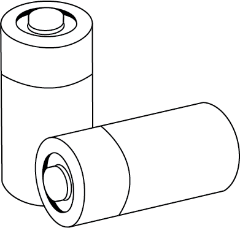

# Extensions and Integrations

The mission of The Yosai Project is to secure any kind of Python application.
Extensions and integrations are added in piecemeal to the Yosai framework to
create the ideal security stack necessary for your application.  You specify
which components to use from within Yosai's yaml settings file.

### Extensions

As illustrated, Yosai consists of a core library.  To provide a complete security solution for applications, the core library uses *extensions* -- components that extend operations enabled by the core.  Examples of extensions include:
- credentials repositories such as relational databases or LDAP directories
- access control policies residing in data sources such as relational databases
- authentication methodologies such as social-media based authentication or
  multi-factor authentication
- caching mechanisms

### Integrations

Yosai is designed to provide security related functionality in such a way that
it can be used with ANY kind of application, including desktop apps, web apps,
internet-enabled devices, etc.

Yosai is adapted to an application through what is known as an *integration*
library.

Since a large number of applications are web-based applications, a
library, yosai.web, is included.  Integrations are created to adopt yosai.web
components to a specific web application.  For instance, the pyramid_yosai
project integrates yosai with the Pyramid Web Framework.

Developers are encouraged to submit to The Yosai Project integrations for
license-compatible projects.

Yosai is being released with "batteries included" so that it may be used in a
project without requiring additional implementation (for quick starts).  To achieve this goal, two integration projects were added to The Yosai Project, providing access to a peristence layer and caching:

### Yosai AlchemyStore

An AccountStore implemented with SQLAlchemy.  The project includes a
basic RBAC data model that uses a flat, non-heirarchical design.  

### Yosai DPCache

This is an integration of the dogpile.cache project.  Yosai reduces objects
to their serializable form using Marshmallow, encodes them, and then caches.
Objects obtained from cache are de-serialized into reduced form and then
re-materialized into Yosai objects.  dogpile.cache supports Redis, Memcached,
and Riak off the shelf, featuring thread-safe asynchronous interaction using a
dogpile lock mechanism.  A “dogpile” lock is one that allows a single thread to
generate an expensive resource while other threads use the “old” value until
the “new” value is ready.

Currently, only the Redis backend has been updated and tested.  If you would like to add other backends, your pull request is welcome.  

### Pyramid Yosai

[This library](https://github.com/YosaiProject/pyramid_yosai) integrates Yosai with the [Pyramid Web Framework](http://www.trypyramid.com).
A fully functional demo project, [MonsterRx](https://github.com/YosaiProject/monster_rx), was
created to show how to use pyramid_yosai and highlights some of Yosai's key features.
