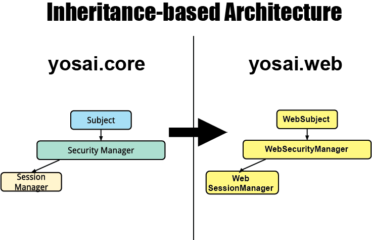

# Web Integration

This section of documentation is dedicated to ``yosai.web``.  

When you install Yosai from PyPI (using the pip installer), you are installing
a package that includes ``yosai.core``, featuring the framework and a "native"
library, and ``yosai.web``, which extends ``yosai.core`` to support web applications.

Web development is so popular that it makes sense to include support for it
from the main Yosai project package.  Further, this approach is consistent with that
taken by the Apache Shiro project.


## Architectural Overview

Yosai enables web support by extending, through inheritance, a few of the key
components (and sub-components), in its architecture:



These components are extended to support interaction with a web-specific API, known
as a ``WebRegistry`` API, that manages a web application's cookies
used to track SessionID and RememberMe and manages other related attributes.


## Web Registry API

``yosai.web`` is designed to integrate with any kind of web application. It can integrate
with any application framework, such as Django, Pyramid, Flask, or Bottle.  This is
made possible through application-specific implementations of the WebRegistry API.  

The WebRegistry API is an interface, specified by an abstract base class (like the
rest of the interfaces defined in Yosai). For instance, a ``pyramid_yosai`` integration
consists of a PyramidWebRegistry implementation, a ``django_yosai`` integration
consist of a DjangoWebRegistry, etc.


## Initializing Web-enabled Yosai

Instantiating a web-enabled instance of Yosai follows the same process as
instantiating a native Yosai instance except that a WebYosai class is used
rather than a Yosai class.  However, web-enabled classes are
used instead of the yosai.core native classes.  These web-enabled classes are
automatically used by a WebSecurityManager.  So, all you need to do in order to
make use of the web-enabled classes is specify in Yosai's yaml settings file that
the WebSecurityManager is used:

```bash
SECURITY_MANAGER_CONFIG:                                                       
    security_manager: yosai.web.WebSecurityManager  
```

```Python
from yosai.web import WebYosai

yosai = WebYosai(env_var='YOSAI_SETTINGS')
```

## Using a Web-enabled Yosai

To secure web applications with Yosai, you open a WebYosai context in an early
stage of a web request's lifecycle, prior to calling views.  The context is
passed two parameters-- a ``WebYosai`` instance and ``WebRegistry`` instance:

```Python

web_registry = xxxWebRegistry(request)

with WebYosai.context(yosai, web_registry):
    response = handle(request)  # just an example of request hooking..
```

A ``WebRegistry`` is specific to a web application implementation.  Consequently,
a ``WebRegistry`` must be created for each web framework / application used.  
For instance, a [PyramidWebRegistry](https://github.com/YosaiProject/pyramid_yosai/blob/master/pyramid_yosai/webregistry.py#L16) is used when integrating Yosai with
applications created with the Pyramid Web Framework.  In the example above,
'xxx' is a placeholder for whatever specific web registry you use.


## Middleware Support:  TBD

Yosai does not yet include any WSGI middleware ports of Apache Shiro's servlet
related functionality.  Pull requests are welcome.
